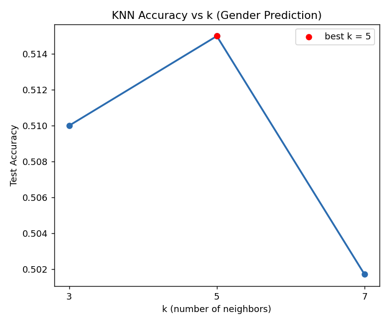
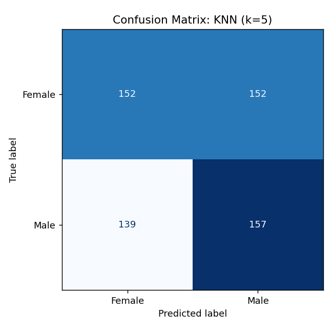

# ใบงานที่ 4: KNN บนชุดข้อมูลที่เลือกเอง

**ชุดข้อมูล:** `dogs_dataset.csv` — สุนัข 3000 ตัว มีคอลัมน์: `Breed` (สายพันธุ์), `Age (Years)` (อายุ), `Weight (kg)` (น้ำหนัก), `Color` (สี), `Gender` (เพศ)

**โจทย์:** ทำนาย `Gender` (Female/Male) จาก `Breed`, `Age`, `Weight`, `Color` ด้วยวิธี K-Nearest Neighbors

## ขั้นตอนการทำงาน (Pipeline)
1. **โหลดและสำรวจข้อมูล** — 3000 แถว ไม่มีค่าว่าง มี 53 สายพันธุ์ 16 สี และคลาสเป้าหมายมีสัดส่วนใกล้เคียงกัน (Female 1520 / Male 1480)
2. **เตรียมข้อมูล (Preprocess)** — ฟีเจอร์เชิงหมวดหมู่ (`Breed`, `Color`) แปลงด้วย one-hot encoding ส่วนฟีเจอร์เชิงตัวเลข (`Age`, `Weight`) ปรับสเกลด้วย `StandardScaler` โดย fit เฉพาะบนชุด train เพื่อป้องกัน data leakage
3. **แบ่งข้อมูล** — 80% train / 20% test แบบ stratified ตาม `Gender`, `random_state=42`
4. **ฝึกโมเดล** — `KNeighborsClassifier` ที่ k = 3, 5, 7
5. **ประเมินผล** — วัดความแม่นยำ (accuracy) บนชุด test ที่ไม่เคยเห็นมาก่อน

รันโค้ดด้วยคำสั่ง:
```bash
python lab1_knn.py
```

## ผลลัพธ์

| k | Accuracy |
|---|----------|
| 3 | 0.5100 |
| 5 | **0.5150** |
| 7 | 0.5017 |

**ค่า k ที่ดีที่สุด = 5**, accuracy = 0.515




## อภิปรายผล

ทั้งสามค่า k ให้ผลใกล้เคียงกันที่ประมาณ 51% ซึ่งสูงกว่าเส้นฐาน (baseline) ของการเดาสุ่มในปัญหาสองคลาสที่สมดุลกัน (50%) เพียงเล็กน้อยเท่านั้น ความแม่นยำไม่ได้เพิ่มขึ้นแบบเป็นเส้นตรงตามค่า k — เพิ่มขึ้นเล็กน้อยจาก k=3 ไป k=5 แล้วลดลงที่ k=7 — แต่ความแตกต่างเหล่านี้ (ไม่เกิน 1.3 จุด) ถือว่าอยู่ในระดับความคลาดเคลื่อนปกติสำหรับชุดทดสอบขนาด 600 แถว จึงสรุปได้ว่าไม่มีค่า k ใดที่ให้ผลดีกว่าค่าอื่นอย่างมีนัยสำคัญ

สาเหตุหลักมาจากลักษณะของชุดข้อมูลเอง กล่าวคือ สายพันธุ์ อายุ น้ำหนัก และสีขนของสุนัข ไม่มีความสัมพันธ์ทางชีววิทยาหรือทางสถิติกับเพศของสุนัขจริง ๆ สายพันธุ์และสีเป็นคุณลักษณะของประชากรสุนัขโดยรวม ไม่ใช่ลักษณะที่ผูกกับเพศ ส่วนอายุและน้ำหนักก็แปรผันไปตามสายพันธุ์มากกว่าเพศ โมเดล KNN จะสามารถใช้ประโยชน์จากโครงสร้างที่มีอยู่ในพื้นที่ฟีเจอร์ได้ก็ต่อเมื่อโครงสร้างนั้นมีความสัมพันธ์กับเป้าหมายเท่านั้น ในกรณีนี้ไม่มีความสัมพันธ์ดังกล่าว ผลลัพธ์ที่ใกล้เคียงระดับการเดาสุ่มจึงเป็นผลลัพธ์ที่ถูกต้องและคาดการณ์ได้ ไม่ใช่ความล้มเหลวของโมเดล ตัวอย่างนี้แสดงให้เห็นว่าประสิทธิภาพของ KNN ถูกจำกัดด้วยคุณภาพและความเกี่ยวข้องของฟีเจอร์ที่ป้อนเข้าไป มากกว่าการปรับจูนค่า k เพียงอย่างเดียว

## ไฟล์ในโฟลเดอร์
- `dogs_dataset.csv` — ชุดข้อมูล
- `lab1_knn.py` — โค้ด pipeline ทั้งหมด (โหลด → เตรียมข้อมูล → ฝึกโมเดลที่ k=3,5,7 → ประเมินผล → สร้างกราฟ)
- `outputs/accuracy_vs_k.png` — กราฟ accuracy เทียบกับค่า k
- `outputs/confusion_matrix_best_k.png` — confusion matrix ของค่า k ที่ดีที่สุด
- `outputs/lab1_knn_results.json` — ผลลัพธ์เชิงตัวเลข
