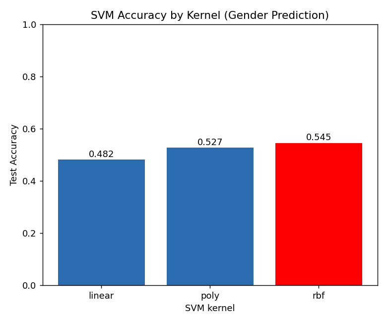
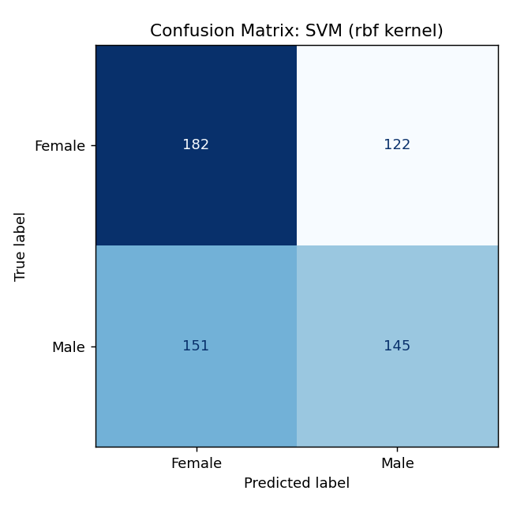

# ใบงานที่ 5: Support Vector Machine บนชุดข้อมูลที่เลือกเอง

**ชุดข้อมูล:** (https://www.kaggle.com/datasets/waqi786/dogs-dataset-3000-records) — สุนัข 3000 ตัว มีคอลัมน์: `Breed` (สายพันธุ์), `Age (Years)` (อายุ), `Weight (kg)` (น้ำหนัก), `Color` (สี), `Gender` (เพศ)

**โจทย์:** ทำนาย `Gender` (Female/Male) จาก `Breed`, `Age`, `Weight`, `Color` ด้วย Support Vector Machine และเปรียบเทียบ kernel แบบต่าง ๆ

## ขั้นตอนการทำงาน (Pipeline)
1. **โหลดและสำรวจข้อมูล** — 3000 แถว ไม่มีค่าว่าง มี 53 สายพันธุ์ 16 สี และคลาสเป้าหมายมีสัดส่วนใกล้เคียงกัน (Female 1520 / Male 1480)
2. **เตรียมข้อมูล (Preprocess)** — ฟีเจอร์เชิงหมวดหมู่ (`Breed`, `Color`) แปลงด้วย one-hot encoding ส่วนฟีเจอร์เชิงตัวเลข (`Age`, `Weight`) ปรับสเกลด้วย `StandardScaler` โดย fit เฉพาะบนชุด train เพื่อป้องกัน data leakage
3. **แบ่งข้อมูล** — 80% train / 20% test แบบ stratified ตาม `Gender`, `random_state=42`
4. **ฝึกโมเดล** — `SVC` (Support Vector Classifier) ด้วย kernel สามแบบ: **linear**, **poly** (polynomial), **rbf**
5. **ประเมินผล** — วัดความแม่นยำ (accuracy) บนชุด test ที่ไม่เคยเห็นมาก่อน

รันโค้ดด้วยคำสั่ง:
```bash
python lab1_svm.py
```

## ผลลัพธ์

| Kernel | Accuracy |
|--------|----------|
| linear | 0.4817 |
| poly   | 0.5267 |
| rbf    | **0.5450** |

**Kernel ที่ดีที่สุด = rbf**, accuracy = 0.545




## อภิปรายผล

Kernel ทั้งสามแบบให้ผลใกล้เคียงกันที่ประมาณ 48-55% ซึ่งอยู่ในระดับใกล้เคียงหรือสูงกว่าเส้นฐาน (baseline) ของการเดาสุ่มในปัญหาสองคลาสที่สมดุลกันเพียงเล็กน้อยเท่านั้น (50%) โดย kernel **rbf** ให้ accuracy สูงที่สุด เนื่องจากสามารถจับ decision boundary ที่ไม่เป็นเส้นตรง (non-linear) ได้ดีกว่า linear kernel ส่วน poly อยู่กึ่งกลางระหว่างสองแบบ อย่างไรก็ตาม ผลต่างระหว่าง kernel เหล่านี้ (ไม่เกิน 6 จุด) ยังถือว่าอยู่ในระดับความคลาดเคลื่อนปกติสำหรับชุดทดสอบขนาด 600 แถว

สาเหตุหลักมาจากลักษณะของชุดข้อมูลเอง กล่าวคือ สายพันธุ์ อายุ น้ำหนัก และสีขนของสุนัข ไม่มีความสัมพันธ์ทางชีววิทยาหรือทางสถิติกับเพศของสุนัขจริง ๆ สายพันธุ์และสีเป็นคุณลักษณะของประชากรสุนัขโดยรวม ไม่ใช่ลักษณะที่ผูกกับเพศ ส่วนอายุและน้ำหนักก็แปรผันไปตามสายพันธุ์มากกว่าเพศ โมเดล SVM จะสามารถหาขอบเขตการแบ่งคลาส (decision boundary) ที่มีความหมายได้ก็ต่อเมื่อฟีเจอร์ที่ป้อนเข้าไปมีความสัมพันธ์กับเป้าหมายเท่านั้น ในกรณีนี้ไม่มีความสัมพันธ์ดังกล่าว ผลลัพธ์ที่ใกล้เคียงระดับการเดาสุ่มจึงเป็นผลลัพธ์ที่ถูกต้องและคาดการณ์ได้ ไม่ใช่ความล้มเหลวของโมเดล ตัวอย่างนี้แสดงให้เห็นว่าประสิทธิภาพของ SVM ถูกจำกัดด้วยคุณภาพและความเกี่ยวข้องของฟีเจอร์ที่ป้อนเข้าไป มากกว่าการเลือก kernel เพียงอย่างเดียว

## ไฟล์ในโฟลเดอร์
- `dogs_dataset.csv` — ชุดข้อมูล
- `lab1_svm.py` — โค้ด pipeline ทั้งหมด (โหลด → เตรียมข้อมูล → ฝึกโมเดลด้วย kernel linear/poly/rbf → ประเมินผล → สร้างกราฟ)
