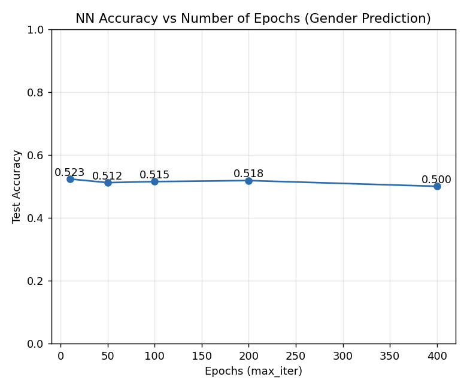
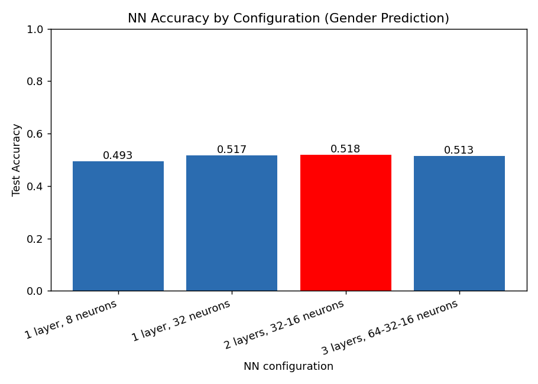
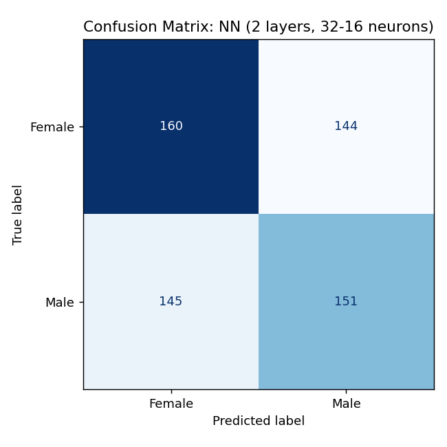

# ใบงานที่ 6: Neural Network บนชุดข้อมูลที่เลือกเอง

**ชุดข้อมูล:** (https://www.kaggle.com/datasets/waqi786/dogs-dataset-3000-records) — สุนัข 3000 ตัว มีคอลัมน์: `Breed` (สายพันธุ์), `Age (Years)` (อายุ), `Weight (kg)` (น้ำหนัก), `Color` (สี), `Gender` (เพศ)

**โจทย์:** ทำนาย `Gender` (Female/Male) จาก `Breed`, `Age`, `Weight`, `Color` ด้วย Neural Network (Multi-Layer Perceptron) และเปรียบเทียบจำนวน epoch และโครงสร้างเครือข่ายแบบต่าง ๆ

## ขั้นตอนการทำงาน (Pipeline)
1. **โหลดและสำรวจข้อมูล** — 3000 แถว ไม่มีค่าว่าง มี 53 สายพันธุ์ 16 สี และคลาสเป้าหมายมีสัดส่วนใกล้เคียงกัน (Female 1520 / Male 1480)
2. **เตรียมข้อมูล (Preprocess)** — ฟีเจอร์เชิงหมวดหมู่ (`Breed`, `Color`) แปลงด้วย one-hot encoding ส่วนฟีเจอร์เชิงตัวเลข (`Age`, `Weight`) ปรับสเกลด้วย `StandardScaler` โดย fit เฉพาะบนชุด train เพื่อป้องกัน data leakage
3. **แบ่งข้อมูล** — 80% train / 20% test แบบ stratified ตาม `Gender`, `random_state=42`
4. **ฝึกโมเดล** — `MLPClassifier` (Neural Network) โครงสร้างพื้นฐาน 2 hidden layers (32-16 neurons):
   - เปรียบเทียบจำนวน epoch (`max_iter`): 10, 50, 100, 200, 400
   - เปรียบเทียบโครงสร้างเครือข่าย (fix epoch = 200): 1 layer (8 neurons), 1 layer (32 neurons), 2 layers (32-16), 3 layers (64-32-16)
5. **ประเมินผล** — วัดความแม่นยำ (accuracy) บนชุด test ที่ไม่เคยเห็นมาก่อน

รันโค้ดด้วยคำสั่ง:
```bash
python lab1_nn.py
```

## ผลลัพธ์

**Accuracy ตามจำนวน epoch (โครงสร้าง 32-16 neurons):**

| Epochs | Accuracy |
|--------|----------|
| 10     | 0.5233   |
| 50     | 0.5117   |
| 100    | 0.5150   |
| 200    | 0.5183   |
| 400    | 0.5000   |

**Accuracy ตามโครงสร้างเครือข่าย (200 epochs):**

| Configuration | Accuracy |
|----------------|----------|
| 1 layer, 8 neurons | 0.4933 |
| 1 layer, 32 neurons | 0.5167 |
| 2 layers, 32-16 neurons | **0.5183** |
| 3 layers, 64-32-16 neurons | 0.5133 |

**โครงสร้างที่ดีที่สุด = 2 layers, 32-16 neurons**, accuracy = 0.5183





## อภิปรายผล

ทุกการตั้งค่า ไม่ว่าจะเป็นจำนวน epoch หรือจำนวน hidden layer/neuron ต่างให้ accuracy อยู่ในช่วงประมาณ 49-52% เท่านั้น ซึ่งใกล้เคียงกับเส้นฐาน (baseline) ของการเดาสุ่มในปัญหาสองคลาสที่สมดุลกัน (50%) แทบทั้งสิ้น การเพิ่มจำนวน epoch จาก 10 ไป 400 ไม่ได้ทำให้ accuracy ดีขึ้นอย่างมีนัยสำคัญ และที่ 400 epoch กลับลดลงเหลือ 0.50 ซึ่งเป็นสัญญาณของการ overfit บนชุด train โดยไม่ได้ช่วยให้โมเดล generalize ดีขึ้น ในทำนองเดียวกัน การเพิ่มความลึกหรือความกว้างของเครือข่าย (จาก 1 layer/8 neurons ไปจนถึง 3 layers/64-32-16 neurons) ก็ไม่ได้ทำให้ผลลัพธ์ดีขึ้นอย่างชัดเจน โครงสร้างที่ดีที่สุด (2 layers, 32-16 neurons) ก็ยังคงมี accuracy ใกล้เคียงกับโครงสร้างอื่น ๆ มาก

ผลลัพธ์เช่นนี้สอดคล้องกับผลของ SVM และ kNN ในใบงานก่อนหน้าบนชุดข้อมูลเดียวกัน กล่าวคือ สาเหตุหลักไม่ได้มาจากตัวโมเดลหรือจำนวน epoch/โครงสร้างเครือข่ายที่ใช้ แต่มาจากลักษณะของชุดข้อมูลเอง — สายพันธุ์ อายุ น้ำหนัก และสีขนของสุนัข ไม่มีความสัมพันธ์ทางชีววิทยาหรือทางสถิติกับเพศของสุนัขจริง ๆ Neural Network แม้จะมีความสามารถในการจับความสัมพันธ์ที่ซับซ้อนและไม่เป็นเส้นตรง (non-linear) ได้ดีกว่าโมเดลเชิงเส้น แต่ก็ไม่สามารถเรียนรู้ความสัมพันธ์ที่ไม่มีอยู่จริงในข้อมูลได้ ตัวอย่างนี้ตอกย้ำว่าประสิทธิภาพของโมเดล ไม่ว่าจะซับซ้อนเพียงใด ก็ยังถูกจำกัดด้วยคุณภาพและความเกี่ยวข้องของฟีเจอร์ที่ป้อนเข้าไปเป็นหลัก มากกว่าการปรับแต่ง hyperparameter เพียงอย่างเดียว

## ไฟล์ในโฟลเดอร์
- `dogs_dataset.csv` — ชุดข้อมูล
- `lab1_nn.py` — โค้ด pipeline ทั้งหมด (โหลด → เตรียมข้อมูล → ฝึก NN เปรียบเทียบ epoch และโครงสร้างเครือข่าย → ประเมินผล → สร้างกราฟ)
