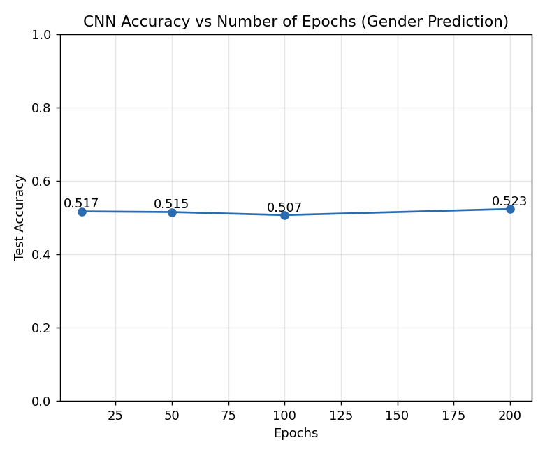
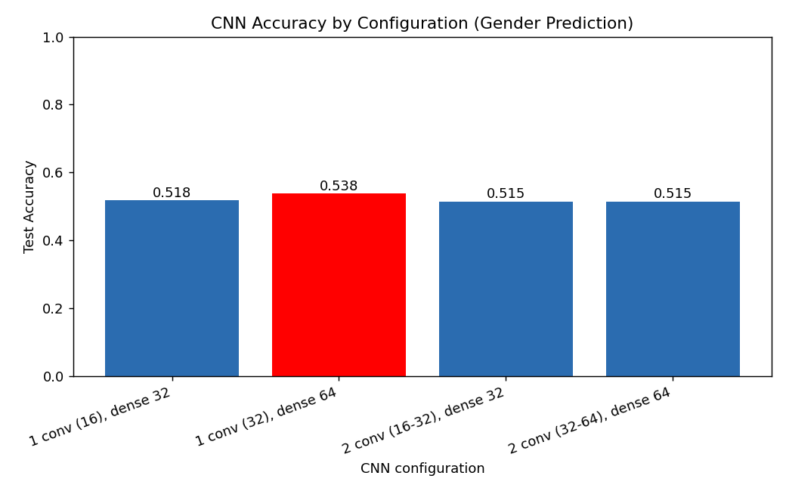
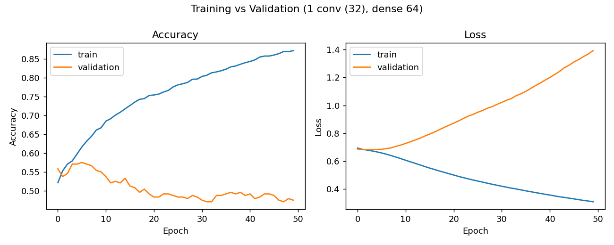
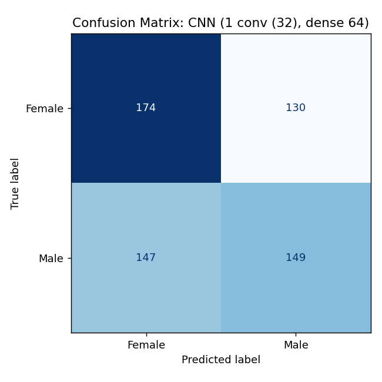

# ใบงานที่ 7: Convolutional Neural Network (CNN) บนชุดข้อมูลที่เลือกเอง

**ชุดข้อมูล:** (https://www.kaggle.com/datasets/waqi786/dogs-dataset-3000-records) — สุนัข 3000 ตัว มีคอลัมน์: `Breed` (สายพันธุ์), `Age (Years)` (อายุ), `Weight (kg)` (น้ำหนัก), `Color` (สี), `Gender` (เพศ)

**โจทย์:** ทำนาย `Gender` (Female/Male) จาก `Breed`, `Age`, `Weight`, `Color` ด้วย Convolutional Neural Network (CNN) และเปรียบเทียบจำนวน epoch และโครงสร้างของ CNN แบบต่าง ๆ เนื่องจากข้อมูลเป็นแบบตาราง (ไม่ใช่ภาพ) จึงใช้ **1D Convolution (Conv1D)** สไลด์ฟิลเตอร์ไปบนเวกเตอร์ฟีเจอร์ที่ผ่านการเข้ารหัสแล้ว

## ขั้นตอนการทำงาน (Pipeline)
1. **โหลดและสำรวจข้อมูล** — 3000 แถว ไม่มีค่าว่าง มี 53 สายพันธุ์ 16 สี และคลาสเป้าหมายมีสัดส่วนใกล้เคียงกัน (Female 1520 / Male 1480)
2. **แบ่งข้อมูล** — 80% train (2400 แถว) / 20% test (600 แถว) แบบ stratified ตาม `Gender`, `random_state=42` และแบ่ง 10% ของชุด train เป็น validation ระหว่างฝึก
3. **เตรียมข้อมูล (Preprocess)** — ฟีเจอร์เชิงหมวดหมู่ (`Breed`, `Color`) แปลงด้วย one-hot encoding ส่วนฟีเจอร์เชิงตัวเลข (`Age`, `Weight`) ปรับสเกลด้วย `StandardScaler` โดย fit เฉพาะบนชุด train เพื่อป้องกัน data leakage ได้เวกเตอร์ฟีเจอร์ยาว 71 ค่า แล้วจัดรูปเป็น (71, 1) เพื่อป้อนเข้า Conv1D
4. **สร้างและฝึก CNN** — Conv1D (kernel 3, ReLU) + MaxPooling → Flatten → Dense (ReLU) → Dense 1 (Sigmoid), optimizer = Adam, loss = binary cross-entropy, batch size = 32:
   - เปรียบเทียบจำนวน epoch: 10, 50, 100, 200 (โครงสร้าง 2 conv layers 16-32 filters, dense 32 neurons)
   - เปรียบเทียบโครงสร้าง CNN (fix epoch = 50): 1 conv (16) + dense 32, 1 conv (32) + dense 64, 2 conv (16-32) + dense 32, 2 conv (32-64) + dense 64
5. **ประเมินผล** — วัดความแม่นยำ (accuracy) บนชุด test ที่ไม่เคยเห็นมาก่อน

รันโค้ดด้วยคำสั่ง:
```bash
pip install tensorflow scikit-learn pandas matplotlib
python lab1_cnn.py
```

## ผลลัพธ์

**Accuracy ตามจำนวน epoch (2 conv layers 16-32, dense 32):**

| Epochs | Accuracy |
|--------|----------|
| 10     | 0.5167   |
| 50     | 0.5150   |
| 100    | 0.5067   |
| 200    | 0.5233   |

**Accuracy ตามโครงสร้าง CNN (50 epochs):**

| Configuration | Accuracy |
|----------------|----------|
| 1 conv (16), dense 32 | 0.5183 |
| 1 conv (32), dense 64 | **0.5383** |
| 2 conv (16-32), dense 32 | 0.5150 |
| 2 conv (32-64), dense 64 | 0.5150 |

**โครงสร้างที่ดีที่สุด = 1 conv (32), dense 64**, accuracy = 0.5383

**Training / Validation ของโครงสร้างที่ดีที่สุด (epoch สุดท้าย):** train accuracy = 0.8718, validation accuracy = 0.4750, train loss = 0.3085, validation loss = 1.3926






ผลการทำนายบนชุด test ของโครงสร้างที่ดีที่สุดบันทึกไว้ที่ `outputs/predictions_best_config.csv` (คอลัมน์ Actual, Predicted และความน่าจะเป็นที่เป็น Male)

## อภิปรายผล

ทุกการตั้งค่า ไม่ว่าจะเป็นจำนวน epoch หรือจำนวน conv layer/neuron ต่างให้ accuracy อยู่ในช่วงประมาณ 51-54% เท่านั้น ซึ่งใกล้เคียงกับเส้นฐาน (baseline) ของการเดาสุ่มในปัญหาสองคลาสที่สมดุลกัน (การเดาคลาสส่วนใหญ่ได้ 50.7% บนชุด test นี้) การเพิ่มจำนวน epoch จาก 10 ไป 200 ไม่ได้ทำให้ accuracy ดีขึ้นอย่างมีนัยสำคัญ (0.507-0.523) และโครงสร้างที่ดีที่สุด (1 conv, 32 filters, dense 64) ได้ 0.538 ซึ่งสูงกว่าโครงสร้างอื่นเพียงประมาณ 2% หรือราว 14 แถวจากชุด test 600 แถว เป็นความต่างที่อยู่ในช่วงความผันผวนของการฝึกและขนาดชุด test จึงไม่ควรสรุปว่าโครงสร้างนี้ดีกว่าจริง

จากกราฟ training/validation พบสัญญาณ overfitting ชัดเจน: train accuracy สูงถึง 0.872 ขณะที่ validation accuracy เหลือเพียง 0.475 และ validation loss (1.393) สูงกว่า train loss (0.309) มาก แสดงว่าโมเดลจำข้อมูลชุด train ได้ แต่สิ่งที่จำไม่สามารถนำไปใช้กับข้อมูลใหม่ได้ ซึ่งเป็นผลที่สอดคล้องกับ kNN, SVM และ Neural Network (MLP) ในใบงานก่อนหน้าบนชุดข้อมูลเดียวกัน กล่าวคือ สาเหตุหลักไม่ได้มาจากตัวโมเดล แต่มาจากลักษณะของชุดข้อมูลเอง — สายพันธุ์ อายุ น้ำหนัก และสีขนของสุนัข ไม่มีความสัมพันธ์ทางชีววิทยาหรือทางสถิติกับเพศของสุนัขจริง ๆ

นอกจากนี้ CNN ถูกออกแบบมาให้ใช้ประโยชน์จากโครงสร้างเชิงพื้นที่ของข้อมูล เช่น พิกเซลที่อยู่ติดกันในภาพ แต่เวกเตอร์ฟีเจอร์ของข้อมูลชุดนี้เกิดจาก one-hot encoding ซึ่งลำดับของคอลัมน์ไม่มีความหมายเชิงความใกล้เคียง ฟิลเตอร์ที่สไลด์ไปบนเวกเตอร์จึงไม่ได้ช่วยดึงรูปแบบที่มีความหมายออกมา ทำให้ CNN ไม่ได้เปรียบ MLP ในงานนี้ และตอกย้ำว่าประสิทธิภาพของโมเดลถูกจำกัดด้วยคุณภาพและความเกี่ยวข้องของฟีเจอร์ รวมถึงความเหมาะสมของสถาปัตยกรรมกับชนิดข้อมูล มากกว่าการปรับ hyperparameter เพียงอย่างเดียว

## ไฟล์ในโฟลเดอร์
- `dogs_dataset.csv` — ชุดข้อมูล
- `lab1_cnn.py` — โค้ด pipeline ทั้งหมด (โหลด → แบ่งข้อมูล → เตรียมข้อมูล → ฝึก CNN เปรียบเทียบ epoch และโครงสร้างเครือข่าย → ประเมินผล → สร้างกราฟและผลทำนาย)
- `outputs/` — กราฟ ผลทำนาย (`predictions_best_config.csv`) และผลลัพธ์ (`lab1_cnn_results.json`)
