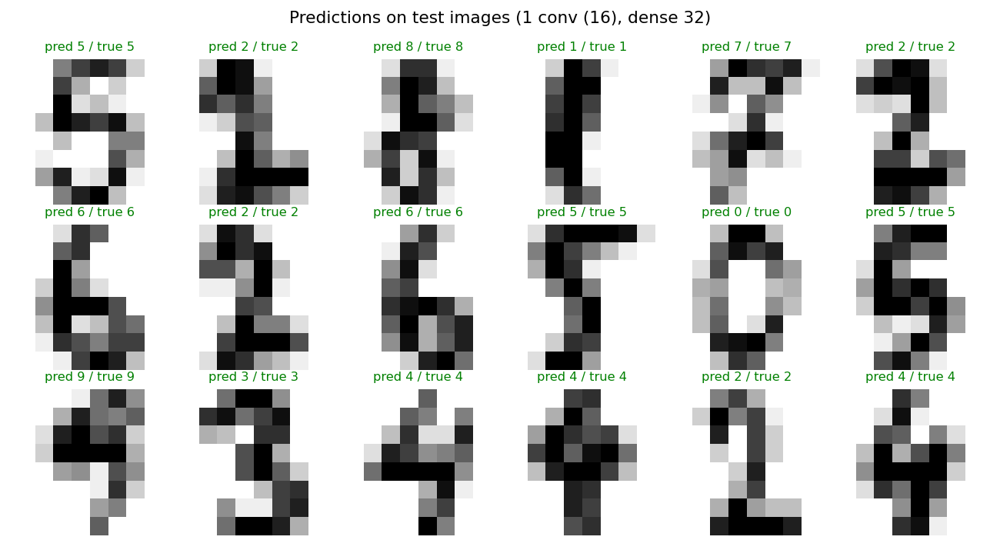

# ใบงานที่ 7: Convolutional Neural Network (CNN) บนชุดข้อมูลที่เลือกเอง

**ชุดข้อมูล:** [Digits (scikit-learn)](https://scikit-learn.org/stable/modules/generated/sklearn.datasets.load_digits.html) — ภาพตัวเลขลายมือ 1797 ภาพ ขนาด 8×8 พิกเซล (ระดับสีเทา) แบ่งเป็น 10 คลาส (ตัวเลข 0-9) โหลดผ่าน `load_digits()` จึงไม่ต้องมีไฟล์ข้อมูลในโฟลเดอร์

**โจทย์:** จำแนกตัวเลขลายมือ (0-9) จากภาพด้วย CNN และเปรียบเทียบจำนวน epoch และโครงสร้างของ CNN แบบต่าง ๆ

## ขั้นตอนการทำงาน (Pipeline)
1. **โหลดข้อมูล** — 1797 ภาพ ขนาด 8×8 มี 10 คลาส
2. **แบ่งข้อมูล** — 80% train (1437 ภาพ) / 20% test (360 ภาพ) แบบ stratified ตามตัวเลข, `random_state=42` และแบ่ง 10% ของชุด train เป็น validation ระหว่างฝึก
3. **ปรับสเกล (Standardize)** — ลบค่าเฉลี่ยและหารด้วยส่วนเบี่ยงเบนมาตรฐานของพิกเซล โดยคำนวณจากชุด train เท่านั้นเพื่อป้องกัน data leakage
4. **สร้างและฝึก CNN** — Conv2D (3×3, ReLU) + MaxPooling → Flatten → Dense (ReLU) → Dense 10 (Softmax), optimizer = Adam:
   - เปรียบเทียบจำนวน epoch: 5, 10, 20, 50 (โครงสร้าง 2 conv layers 16-32 filters, dense 32 neurons)
   - เปรียบเทียบโครงสร้าง CNN (fix epoch = 20): 1 conv (16) + dense 32, 2 conv (16-32) + dense 32, 2 conv (16-32) + dense 64, 3 conv (16-32-64) + dense 64
5. **ประเมินผล** — วัดความแม่นยำ (accuracy) บนชุด test ที่ไม่เคยเห็นมาก่อน

รันโค้ดด้วยคำสั่ง:
```bash
pip install tensorflow scikit-learn matplotlib
python lab1_cnn.py
```

## ผลลัพธ์

**Accuracy ตามจำนวน epoch (2 conv layers, dense 32):**

| Epochs | Accuracy |
|--------|----------|
| 5      | 0.9472   |
| 10     | 0.9667   |
| 20     | 0.9750   |
| 50     | **0.9861** |

**Accuracy ตามโครงสร้าง CNN (20 epochs):**

| Configuration | Accuracy |
|----------------|----------|
| 1 conv (16), dense 32 | **0.9778** |
| 2 conv (16-32), dense 32 | 0.9694 |
| 2 conv (16-32), dense 64 | 0.9694 |
| 3 conv (16-32-64), dense 64 | 0.9750 |

**โครงสร้างที่ดีที่สุด = 1 conv (16), dense 32**, accuracy = 0.9778

**Training / Validation ของโครงสร้างที่ดีที่สุด (epoch สุดท้าย):** train accuracy = 0.9961, validation accuracy = 0.9792, train loss = 0.0399, validation loss = 0.0814





## อภิปรายผล

เมื่อเพิ่มจำนวน epoch จาก 5 เป็น 50 accuracy บนชุด test เพิ่มขึ้นอย่างต่อเนื่องจาก 0.947 เป็น 0.986 โดยการเพิ่มขึ้นมากที่สุดอยู่ในช่วง 5-10 epoch แรก หลังจากนั้นเพิ่มขึ้นช้าลง แสดงว่าโมเดลเริ่มเรียนรู้ได้เกือบเต็มที่แล้ว ส่วนกราฟ training/validation พบว่า train accuracy (0.996) สูงกว่า validation accuracy (0.979) และ validation loss (0.081) สูงกว่า train loss (0.040) เล็กน้อย ซึ่งเป็นสัญญาณเริ่มต้นของ overfitting แต่ยังไม่รุนแรง

สำหรับการเปรียบเทียบโครงสร้าง ทุกโครงสร้างให้ accuracy อยู่ในช่วง 0.969-0.978 ต่างกันไม่ถึง 1% (ประมาณ 3 ภาพจากชุด test 360 ภาพ) ซึ่งเป็นความต่างที่น้อยเกินกว่าจะสรุปว่าโครงสร้างใดดีกว่าอย่างมีนัยสำคัญ และโครงสร้างที่ง่ายที่สุด (1 conv layer) กลับได้ผลดีที่สุด เนื่องจากภาพมีขนาดเล็กเพียง 8×8 พิกเซลและเป็นปัญหาที่ไม่ซับซ้อน การเพิ่มจำนวน conv layer หรือ neuron จึงไม่ได้ช่วยเพิ่มความสามารถของโมเดลอย่างชัดเจน ทั้งนี้ผลของแต่ละการฝึกอาจแตกต่างกันเล็กน้อยตามค่าเริ่มต้นแบบสุ่มของน้ำหนัก (เช่น โครงสร้าง 2 conv + dense 32 ที่ 20 epoch ได้ 0.975 ในการทดลองเปรียบเทียบ epoch และ 0.969 ในการทดลองเปรียบเทียบโครงสร้าง) ซึ่งตอกย้ำว่าความต่างระดับนี้อยู่ในช่วงความผันผวนของการฝึก

## ไฟล์ในโฟลเดอร์
- `lab1_cnn.py` — โค้ด pipeline ทั้งหมด (โหลด → แบ่งข้อมูล → ปรับสเกล → ฝึก CNN เปรียบเทียบ epoch และโครงสร้าง → ประเมินผล → สร้างกราฟและผลทำนาย)
- `outputs/` — กราฟและผลลัพธ์ (`lab1_cnn_results.json`)
